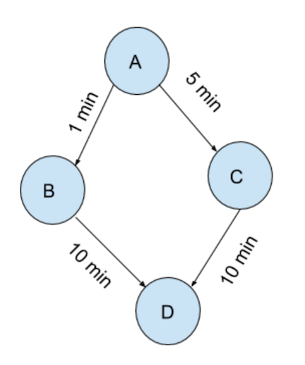

## Greedy Technique - Introduction
A `Greedy Technique` is the one which picks up the "best" possible solution to a sub-problem available at the moment. Greedy algorithms is the collective name given to algorithms which make use of the `Greedy Technique`. The step by step process of these algorithms may be different. However, if any algorithm follows the `Greedy Technique` at each step, it can be called as a Greedy Algorithm.

### Example 1

As the name suggests, in greedy technique, we get greedy and follow the `best possible solution at each step` of the algorithm. Consider the following scenario

The following 4 points - `A, B, C, D` denote 4 corners of a city. You are standing at `A` and want to reach `D` as soon as possible. . However, there are only two ways in which you can do this. You can either go via `B` or you can go via `C`. 
* Reaching `B` from `A` takes 1 min and reaching `D` from `B` takes 10 mins.

* Reaching `C` from `A` takes 5 min and reaching `D` from `C` takes 10 mins.

### Solution using Greedy Approach
If we follow the `greedy technique`, we will choose to go via `B`. If we go to `C`, it would take 5 mins. However, going to `B` only takes 1 min.  Therefore, while standing at `A`, going via `B` seems to be the better solution.

Thus, in our final solution, we will reach `D` in 11 minutes if we follow the greedy technique.

### Example 2
Let's consider the same scenario again but with slight changes. This time, let the time taken to reach `D` from `B` be 20 minutes. 

### Solution using Greedy Approach
If we follow the `greedy technique` again, we will have to go via `B` because when we are at `A` going to `B` seems like a better choice. 

But notice that if we go via `B`, the total time taken to reach `D` will be 21 minutes compared to 15 minutes if we go via `C`. So in this case following the greedy approach does not help us. **Rather, it gives us a less efficient solution.**

This is a key point to remember. Greedy Algorithms might not be the most effective at all times. Rather, in most of the cases, greedy solutions tend to have worse efficiency compared to some of the other techniques such as Divide and Conquer, Dynamic Programming etc. However, there are problems where following the greedy approach also results in an efficient - best overall solution. 

Some of the famous greedy algorithms ares:
1. Dijkstra's Shortest Path Algorithm
2. A* search Algorithm
3. Prim's algorithm for Minimal Spanning Tree
4. Kruskal's algorithm for Minimal Spanning Tree
5. Knapsack Problem
6. Travelling Salesman Problem
    
We will see implementation of a few these algorithms in the upcoming lessons.

## Takeaways

1. In a greedy solution, we go for the best possible choice at each step of the algorithm. 

2. Because we are not considering future scenarios (and are only concerned with the best choice at each step), a greedy solution might not be the most effective solution for the problem.

To decide whether or not to use a greedy approach for a particular problem, try to think whether or not the greedy technique will work for all the future steps of the algorithm.